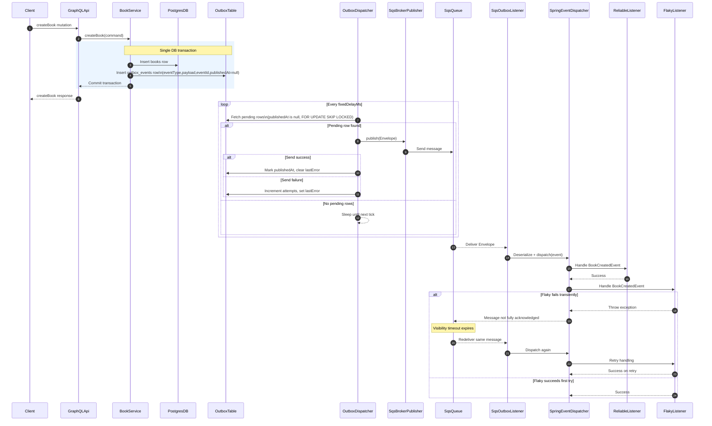

# Transactional Outbox End-to-End Sequence

```mermaid
sequenceDiagram
    autonumber
    participant Client
    participant GraphQL as GraphQLApi
    participant BookSvc as BookService
    participant TxDB as PostgresDB
    participant OutboxTbl as OutboxTable
    participant Dispatcher as OutboxDispatcher
    participant BrokerPub as SqsBrokerPublisher
    participant SQS as SqsQueue
    participant SqsListener as SqsOutboxListener
    participant EventBus as SpringEventDispatcher
    participant Reliable as ReliableListener
    participant Flaky as FlakyListener

    Client->>GraphQL: createBook mutation
    GraphQL->>BookSvc: createBook(command)

    rect rgb(235, 245, 255)
    Note over BookSvc,OutboxTbl: Single DB transaction
    BookSvc->>TxDB: Insert books row
    BookSvc->>OutboxTbl: Insert outbox_events row\n(eventType,payload,eventId,publishedAt=null)
    BookSvc-->>GraphQL: Commit transaction
    end
    GraphQL-->>Client: createBook response

    loop Every fixedDelayMs
        Dispatcher->>OutboxTbl: Fetch pending rows\n(publishedAt is null, FOR UPDATE SKIP LOCKED)
        alt Pending row found
            Dispatcher->>BrokerPub: publish(Envelope)
            BrokerPub->>SQS: Send message
            alt Send success
                Dispatcher->>OutboxTbl: Mark publishedAt, clear lastError
            else Send failure
                Dispatcher->>OutboxTbl: Increment attempts, set lastError
            end
        else No pending rows
            Dispatcher-->>Dispatcher: Sleep until next tick
        end
    end

    SQS-->>SqsListener: Deliver Envelope
    SqsListener->>EventBus: Deserialize + dispatch(event)
    EventBus->>Reliable: Handle BookCreatedEvent
    Reliable-->>EventBus: Success
    EventBus->>Flaky: Handle BookCreatedEvent

    alt Flaky fails transiently
        Flaky-->>EventBus: Throw exception
        EventBus-->>SQS: Message not fully acknowledged
        Note over SQS: Visibility timeout expires
        SQS-->>SqsListener: Redeliver same message
        SqsListener->>EventBus: Dispatch again
        EventBus->>Flaky: Retry handling
        Flaky-->>EventBus: Success on retry
    else Flaky succeeds first try
        Flaky-->>EventBus: Success
    end
```
